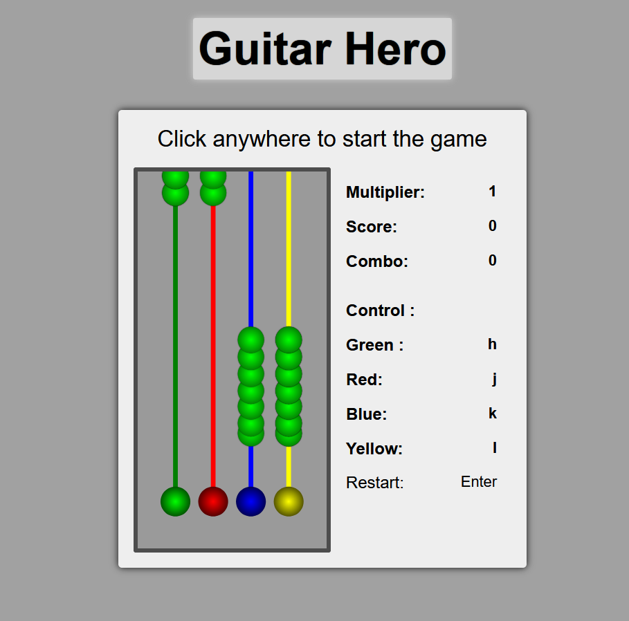
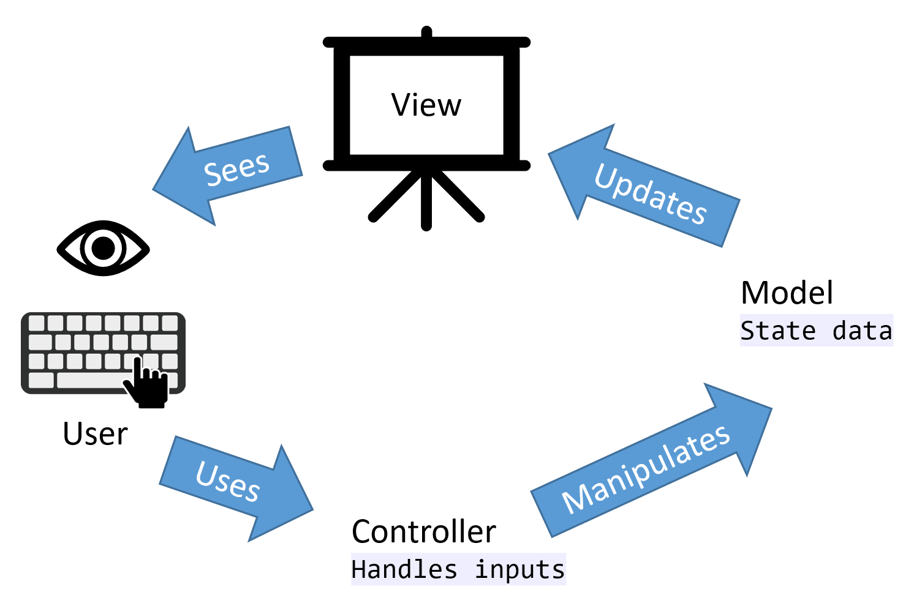

# Guitar Hero RxJs
Remake of the game Guitar Hero, implemented in TypeScript using RxJs Observable streams to handle animation, user interaction and other similar stream behavior.


## Code Design Overview
The code follows the principles of Functional Reactive Programming (FRP) by implementing 
observables from the RxJS library to handle asynchronous events. In this Guitar Hero-style 
game, user inputs are treated as asynchronous events that need to be processed in real-time. 
The game is structured using the Model-View-Controller (MVC) architecture, which decouples 
the logic for handling user input (controller), updating the game state (model), and rendering the 
UI based on that state (view).



In the Code, The Controller is represented by the observable streams, which listen for keydown and keyup 
events from the user. These observables detect specific key presses and map these inputs to 
corresponding actions, which are then processed by the game. The Model in the game is represented by the State object, which encapsulates the current state 
of the game. The state is updated through actions produced by the controller. The reduceState 
function applies each action to the current state to get the new state of the game when an 
action is emitted. The apply method is coded such that it adheres to functional programming 
principles. For example, employing techniques such as function composition, higher-order 
functions, and currying to transform elements within arrays of the state. Instead of mutating the 
state directly, the apply method of an action creates and returns a new State object. This 
approach maintains function purity and ensures that state transformations are predictable and 
manageable.


## Usage
Run the following command :
```
npm install
npm run dev
```
After running the command, open http://localhost:5173 in a browswer


